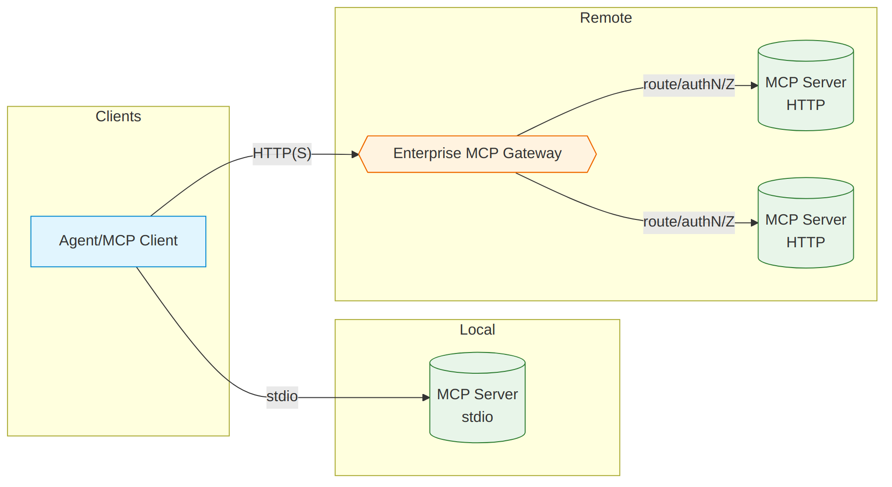
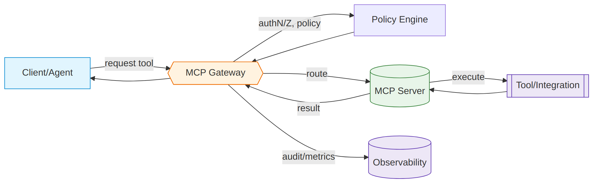

# MCP Best Practices — Enterprise Guide

This guide provides high‑level, vendor‑neutral guidance for building, deploying, and operating MCP servers in production. It emphasizes principles and patterns that scale in enterprise environments, focusing on security, reliability, and maintainability.

## What Is MCP (and why it matters)

The Model Context Protocol is an open standard that connects AI applications (clients) to the systems where context and actions live (servers). Instead of bespoke, per‑app integrations, MCP defines a consistent way to discover capabilities and invoke them safely:

- Servers expose tools, resources, and prompts with typed schemas and descriptions.
- Clients connect over stdio (local) or streamable HTTP (remote) to discover and call capabilities.
- The protocol enables secure, auditable action execution with clear contracts, making it the preferred standard for building AI tools at enterprise scale.

In this guide, "AI tools" are implemented as MCP servers. Treat MCP as the default interface for agent‑accessible capabilities.

### MCP Core Concepts

- **Tools**: Executable actions with explicit input/output schemas, constraints, and side‑effect disclosures.
- **Resources**: Readable data sources (files, records, documents) the client can fetch for model context.
- **Prompts**: Pre‑defined interaction templates that standardize tasks and reduce prompt drift.
- **Discovery**: Clients enumerate available tools/resources/prompts and obtain schemas at connect time.
- **Authorization**: Servers enforce scopes/roles per tool, with optional approvals for high‑risk actions.
- **Transports**: stdio for local processes; streamable HTTP for remote services and scale‑out.

## Design Principles

- **Single responsibility**: One clear domain and authentication boundary per server.
- **Bounded toolsets**: Focused tools with specific contracts; avoid "kitchen‑sink" servers.
- **Contracts first**: Strict input/output schemas, explicit side effects, documented errors.
- **Additive change**: Version schemas; prefer additive evolution; publish deprecations.
- **Stateless by default**: Keep execution stateless for scale and resiliency.
- **Security by design**: Integrate identity, authorization, and audit into the server—not around it.
- **Controlled autonomy**: Offer precise, least-privilege tools with approval paths for high-impact actions.

## Architecture and Deployment

### Transport and Topology

- **stdio**: Best for local, per-user integrations launched by a client. Strong default isolation; limited for centralized operations.
- **Streamable HTTP**: Best for remote, shared services and scale-out. Requires standard web hardening and production SRE practices.
- **Direct vs. gateway**: Direct connections are simple; gateway patterns centralize authN/Z, routing, catalogs, and policy enforcement for many servers.

### MCP Gateway Pattern

Use an enterprise MCP Gateway when you need centralized security, control, and scale across many servers and tenants. The gateway becomes the single, policy‑enforced ingress for agent access to organizational capabilities.

**Gateway responsibilities:**
- **Centralized control**: Authentication, authorization, routing, rate limiting, quotas, and service discovery/catalog
- **Security boundary**: Terminate TLS, enforce mTLS to backends, broker OAuth tokens/scopes, translate permissions per tool
- **Policy and guardrails**: Apply policy‑as‑code (e.g., OPA) for tool allow/deny, environment gating, approval requirements
- **Multi‑tenancy**: Per‑tenant isolation for configs, keys, logs, metrics, limits, and catalogs
- **Governance and audit**: Standardized logging, request correlation, audit trails across all servers
- **Reliability and scale**: HA, autoscaling, circuit breaking, retries with idempotency, backpressure

### Local vs Remote Deployment

- **Local (stdio)**: Per‑user, ephemeral processes; strong isolation, no inbound networking, direct access to local context. Best for developer tools and privacy‑sensitive workflows.
- **Remote (HTTP)**: Shared, multi‑tenant services managed by platform teams; central policy, observability, and scaling. Best for enterprise integrations.
- **Hybrid**: Local servers for personal context + remote servers for enterprise systems, mediated by a gateway for unified policy.

### Multi-tenancy and Isolation

- **Single-tenant by default**: Simplifies auditing, secrets, and blast radius
- **Explicit tenancy boundaries**: Separate data paths, keys, and logs by tenant
- **Workload isolation**: Use containers with non-root users, read-only filesystems, minimal base images

## Security Foundations

### Identity and Access

- **OAuth 2.0 per MCP specification**: Implement authorization flows and token refresh; scope permissions per tool and per action (read vs. write)
- **Least privilege**: Default to read-only tools; enable write/edit tools behind explicit roles and policies
- **Fine-grained authorization**: Enforce per-tool, per-parameter authorization checks; require approvals for high-risk operations

### Input/Output Safety

- **Validate inputs**: Enforce strong schemas, types, ranges, and patterns; reject on first failure
- **Sanitize outputs**: Prevent injection into downstream systems; clearly label side effects and references
- **Guardrails and approvals**: Add policy checks before execution and require user approval where warranted

### Secrets and Transport

- **Managed secrets**: Store credentials in enterprise secret managers; never inline secrets in configs or code
- **TLS everywhere**: Encrypt HTTP transport; sign and verify containers and artifacts; use trusted registries only
- **Network policy**: Restrict egress/ingress; apply service-to-service authentication and explicit allowlists

## Tooling Discipline

### Tool Design

- **Specific, actionable descriptions**: State purpose, constraints, and side effects. Include usage guidance and follow-up steps
- **Stable interfaces**: Version tool schemas; prefer additive changes; announce deprecations with timelines
- **Bounded capability**: Avoid "kitchen-sink" tools; break into focused, testable actions

### Toolset Management

- **Read-only mode**: Support deployment with read-only tools by configuration
- **Dynamic enablement**: Enable/disable tools based on tenant, role, environment, or risk level
- **Production filtering**: Exclude destructive operations in production; gate sensitive tools behind approvals

### State Management

- **Stateless by default**: Keep execution stateless for scale and resiliency
- **Externalize state**: Use managed stores (cache, DB) with clear TTLs and PII handling; avoid hidden server memory

### Long-Running and Side-Effecting Operations

- **Asynchronous patterns**: For operations exceeding request timeouts, return a handle and provide status/poll tools
- **Idempotency keys**: Require client-provided idempotency keys for create/update operations
- **Compensating actions**: Document and provide explicit rollback tools where feasible

## Scalability and Reliability

- **Horizontal scale**: Design for concurrent, short-lived requests; prefer idempotent operations and safe retries
- **Rate limiting and backpressure**: Apply per-tenant, per-tool limits; surface "try later" semantics; protect upstream systems
- **Health, readiness, and circuit breakers**: Publish health endpoints; trip on dependency failures; shed load gracefully
- **Caching and batching**: Cache read-heavy operations with TTL; batch compatible requests to reduce API usage and cost
- **Compatibility and versioning**: Version the server, tool schemas, and side-effect contracts; provide feature detection

### Performance Practices

- **Concurrency model**: Use async I/O for network-bound tools; bound worker pools for CPU tasks; avoid global locks
- **Hot-path optimization**: Pre-warm connections, cache tokens, and reuse HTTP clients with timeouts and retries
- **Budgeting**: Track token, API, and compute budgets per tenant; shed non-critical work under pressure

## Observability and Governance

- **Structured audit trails**: Capture who/what/when/why, including tool arguments (with redaction), decisions, and outcomes
- **Metrics that matter**: Track tool success rate, latency, error classes, approval deferrals, and policy denials
- **Policy as code**: Centralize guardrails (e.g., OPA) and apply consistently across environments
- **Curated catalogs**: Maintain an approved server catalog with ownership, versions, capabilities, security review dates, and compliance tags

### SLOs and Runbooks

- **SLOs**: Define success rate, p95 latency, and error budgets per critical tool
- **Runbooks**: Document common failures, dependency outages, rate-limit responses, and rollback steps
- **Change windows**: Coordinate releases with dependency owners; pin versions and provide rollbacks

## Operations and Tenancy

- **Environments**: Separate dev/stage/prod credentials, routes, policies, quotas; avoid cross‑env leakage
- **Tenancy**: Per‑tenant configs/logs/metrics/limits; tenant‑aware authZ; discovery reflects tenant/env differences
- **Quotas & budgets**: Per‑tenant/tool limits; alerting; auto‑degrade non‑critical work when over budget
- **Dependency protection**: Bounded concurrency, backoff with jitter; strict validation of third‑party responses

## Build vs. Reuse

- **Prefer official/vendor servers**: Start with vendor‑provided MCP servers for common SaaS and internal platforms
- **Vet and catalog**: Only adopt servers that are maintained, reviewed, versioned, and policy‑compliant
- **Extend before rewrite**: Contribute fixes upstream or wrap with gateway policies; build custom servers only when gaps are material
- **Exit criteria**: If a third‑party server falls behind (security, compatibility, maintenance), plan a controlled migration

## Testing and Quality

- **Cross‑model evaluation**: Validate tool discovery and execution across hosted and local models; monitor behavioral drift
- **Security tests**: Negative testing, authorization bypass attempts, input fuzzing, and rate-limit validation
- **Load and chaos**: Establish SLOs; test degradations, dependency outages, and retry/idempotency behavior
- **Pre-release gates**: Block releases on failing quality, security, or performance thresholds
- **Contract tests**: Maintain tool schema contract tests and golden responses for backward compatibility

## Packaging and Distribution

### Containerization Best Practices

- **Minimal base images**: Distroless/UBI minimal; remove compilers and shells at runtime; run as non‑root
- **Health endpoints**: Implement `/health` and `/ready`; wire liveness/readiness probes with sane thresholds
- **Provenance**: Generate SBOM (e.g., CycloneDX), sign images (cosign), and maintain attestations
- **Dependency hygiene**: Pin versions, use lock files, avoid transitive risk; automate vulnerability PRs

### Supply Chain Security

- **SBOMs**: Produce per‑build SBOMs and store with artifacts; fail builds on critical vulnerabilities
- **Signing**: Sign containers and manifests; verify at deploy; enforce signature policy in clusters
- **Reproducibility**: Deterministic builds, pinned bases, and cached layers; record build metadata

## Language and SDK Choices

- **Python**: Fastest iteration, rich data/ML ecosystem, great async I/O for network‑bound tools. Mind GIL for CPU tasks and cold‑start time.
- **Go**: Single static binary, low memory footprint, strong concurrency model. Excellent for high‑throughput, low‑latency services.
- **TypeScript/Node**: Mature ecosystem for web/API tooling, first‑class async I/O, easy JSON handling. Good for API wrappers.
- **SDK maturity**: Official TypeScript and Python SDKs tend to lead; Go SDK is evolving. Prefer official SDKs; pin versions.

**Principle**: Choose the language that best matches your operational model and integration profile. Optimize for maintainability, observability, and SLOs—not theoretical speed.

## Quick Build Checklist

✅ **Purpose and scope**: Single, clearly defined server role and bounded toolset  
✅ **SDK and spec**: Official SDK where possible; document SDK/spec versions  
✅ **Security**: OAuth scopes, least-privilege tools, approvals for high-risk actions, secrets in a manager  
✅ **Validation**: Strong input schemas, output sanitization, error taxonomy and retries with idempotency  
✅ **Operations**: Health/readiness, rate limits, backpressure, circuit breakers, and basic SLOs  
✅ **Observability**: Structured audit logs, metrics (success/latency/errors), tracing/correlation IDs  
✅ **Compatibility**: Versioned tool schemas, deprecation policy, feature detection, contract tests  
✅ **Packaging**: Minimal signed container, non‑root runtime, reproducible builds  
✅ **Docs**: README with capabilities/tags, environment variables, runbooks, and changelog  

## Production Readiness Checklist

✅ **Identity and authorization** implemented with least privilege and approvals for high-risk tools  
✅ **Input validation, output sanitization, and policy guardrails** in place  
✅ **Audit logging, metrics, and alerts** wired into enterprise observability  
✅ **Rate limits, backpressure, health checks, and circuit breakers** configured  
✅ **Secrets in a managed store**; containers minimal, signed, and non-root  
✅ **Versioned APIs and tools** with clear deprecation paths and compatibility tests  
✅ **Documented SLOs, runbooks, incident response, and rollback procedures**  

## Enterprise Adoption Patterns

- **Host responsibilities**: Client apps must show full tool descriptions, request approvals for risky actions, and prevent tool shadowing
- **Environment segmentation**: Distinct dev/stage/prod; different toolsets and policies per environment
- **Change management**: Deprecation policies, version pinning, rollback strategies, and migration guidance

---

MCP servers succeed in the enterprise when they are treated as durable products: narrowly scoped, strongly governed, observable, and easy to evolve. Favor clarity, safety, and operability over breadth—then scale capabilities through catalogs and consistent patterns rather than bespoke implementations.

**See also**: Overview, Develop, Test, Package, Deploy, Operate, Secure, Use.